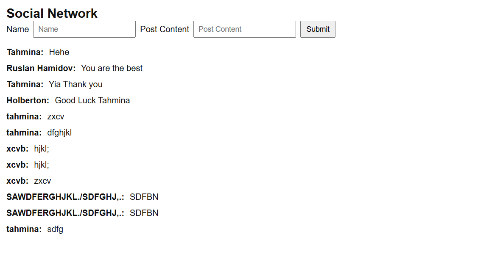

# Simple Social Network 🚀

A lightweight, full-stack social network application built with **Python** and **Flask**. This project allows users to post messages in real-time using a simple and minimalist interface.

---

## 📸 Project Preview

Here is the final look of the application:

---

## ✨ Features

* **Backend:** Powered by Flask.
* **Database:** Persistent storage using SQLite3.
* **Frontend:** Minimalist UI built with HTML and Jinja2 templating.
* **Minimalist Design:** Clean, distraction-free interface following the John Fisher tutorial style.

---

## 📂 Project Structure

* `app.py`: The main entry point that handles server routes and requests.
* `models.py`: Contains the logic for database interaction (creating and fetching posts).
* `templates/index.html`: The frontend template that displays the form and posts.
* `schema.sql`: Defines the database table structure.
* `database.db`: The SQLite database file.

---

### 🎓 Educational Context
This project was developed as a practical assignment for **Holberton School**, focusing on understanding full-stack development and database integration.
